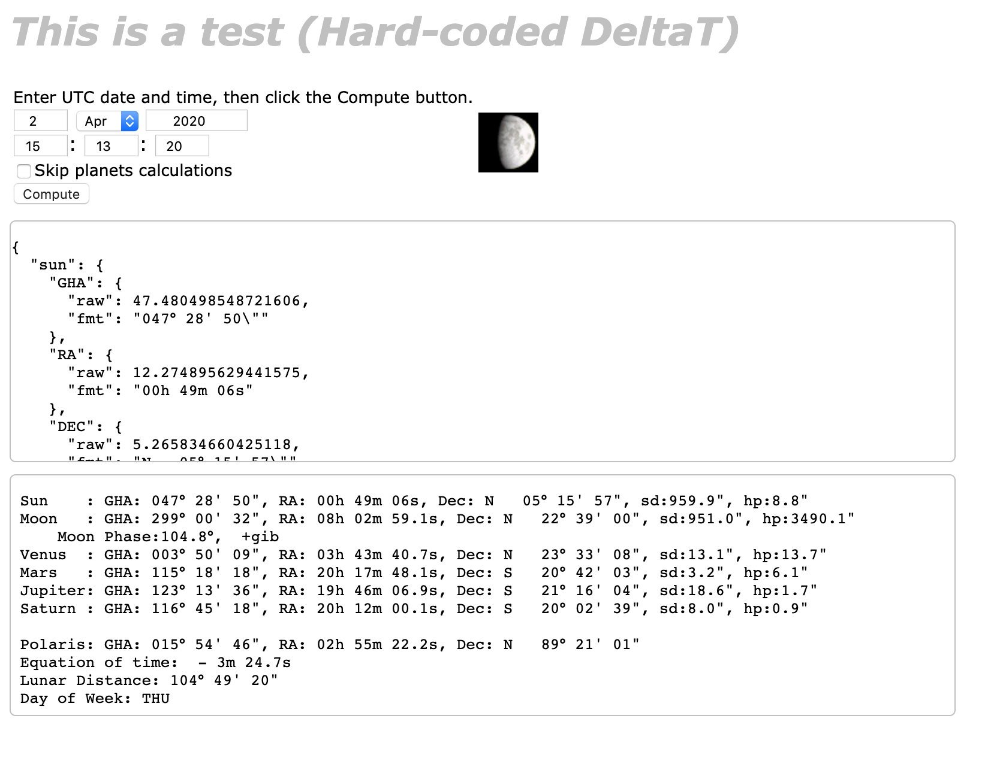

# JS Celestial Almanac
- Ported in ES6 from [Henning Umland](https://www.celnav.de/)'s code.
- See the original web page [here](https://www.celnav.de/longterm.htm), for reference.
- Henning Umland's "[A Short Guide to Celestial Navigation](http://www.titulosnauticos.net/astro/)"

### Test it from NodeJS
Start the provided node server:
```
 $ node server.js
 ----------------------------------------------------
Usage: node /Users/xxxx/repos/ganzhi/public/astro/server.js --verbose:true|false --port:XXXX --wdir:path/to/working/dir
----------------------------------------------------
arg #0: /usr/local/bin/node
arg #1: /Users/xxxx/repos/ganzhi/public/astro/server.js
----------------------------------------------------
Your working directory: /Users/xxxx/repos/ganzhi/public/astro
----------------------------------------------------
Wed Feb 12 2020 09:32:54 GMT-0800 (PST): Starting server on port 8080
Wed Feb 12 2020 09:32:54 GMT-0800 (PST): Server is listening on port 8080

```
Then from a browser, load `http://localhost:8080/index.html` and follow the instructions on the page.

You should get a JSON object, and formatted output like this:



As you would see, it returns the celestial configuration for the current UTC date.

It returns data for the following bodies:
 - `Sun`
 - `Moon`
 - `Venus`
 - `Mars`
 - `Jupiter`
 - `Saturn`
 - `Polaris`

For each body, it gives:
- the Greenwich Hour Angle (`GHA`), raw in decimal degrees and formatted in **degrees**, minutes, and seconds.
- the Right Ascension (`RA`), raw in decimal degrees and formatted in **hours**, minutes and second
- the Declination (`DEC`), raw in decimal degrees and formatted in degrees, minutes and seconds (N or S)
- the Semi-Diameter (`SD`), raw in **seconds** of arc and formatted the same way
- the Horizontal Parallax (`HP`), raw in **seconds** of arc and formatted the same way
- the illumination (`illum`) in %, except for the `Sun`

`Polaris` obviously does not have semi-diameter, horizontal parallax, nor illumination.

In addition for the `Moon`, there is also the phase (raw in degrees, and formatted for display).

Values are in degrees, from `0` to `360`
- `0` and `360`: New Moon
- `90`: First quarter
- `180`: Full Moon
- `270`: Last Quarter

There is also the Equation of Time (`EoT`), raw in signed decimal **minutes**, and formatted in minutes and seconds.

And also some extra data, related to time, equation of equinoxes, and other goodies.

## How to use it
As shown in the _module_ `app.js` (loaded from `index.html`), you need to import `longterm.almanac.js` (from an `import` statement), and then
invoke the `calculate` function to get the `JSON` object featured above.

> Note: DeltaT is to be provided at runtime. It can be obtained from [here](http://maia.usno.navy.mil/).

## Production
The script `publish.sh` uses `WebPack` to produce the required artifacts in a `lib` sub-folder.
The resource to point to from `app.js` would be `./lib/celestial-computer.min.js`.


---
